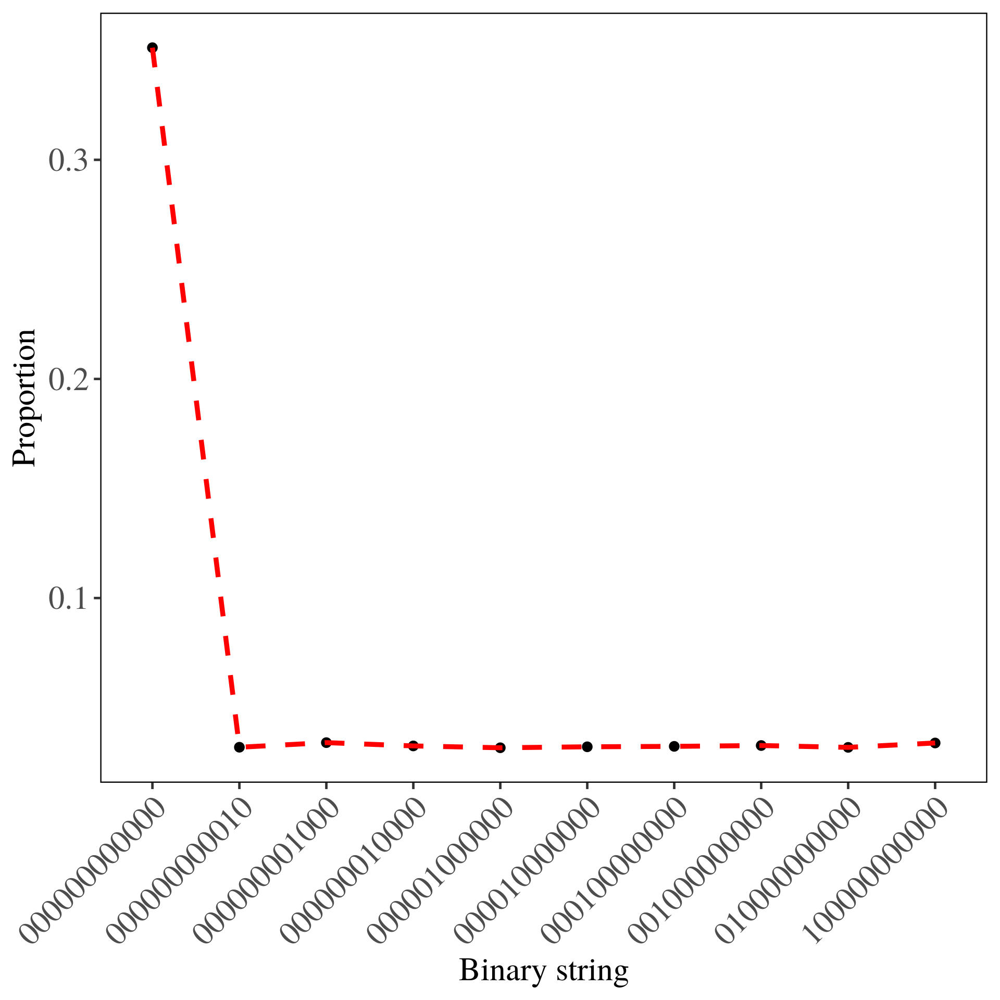
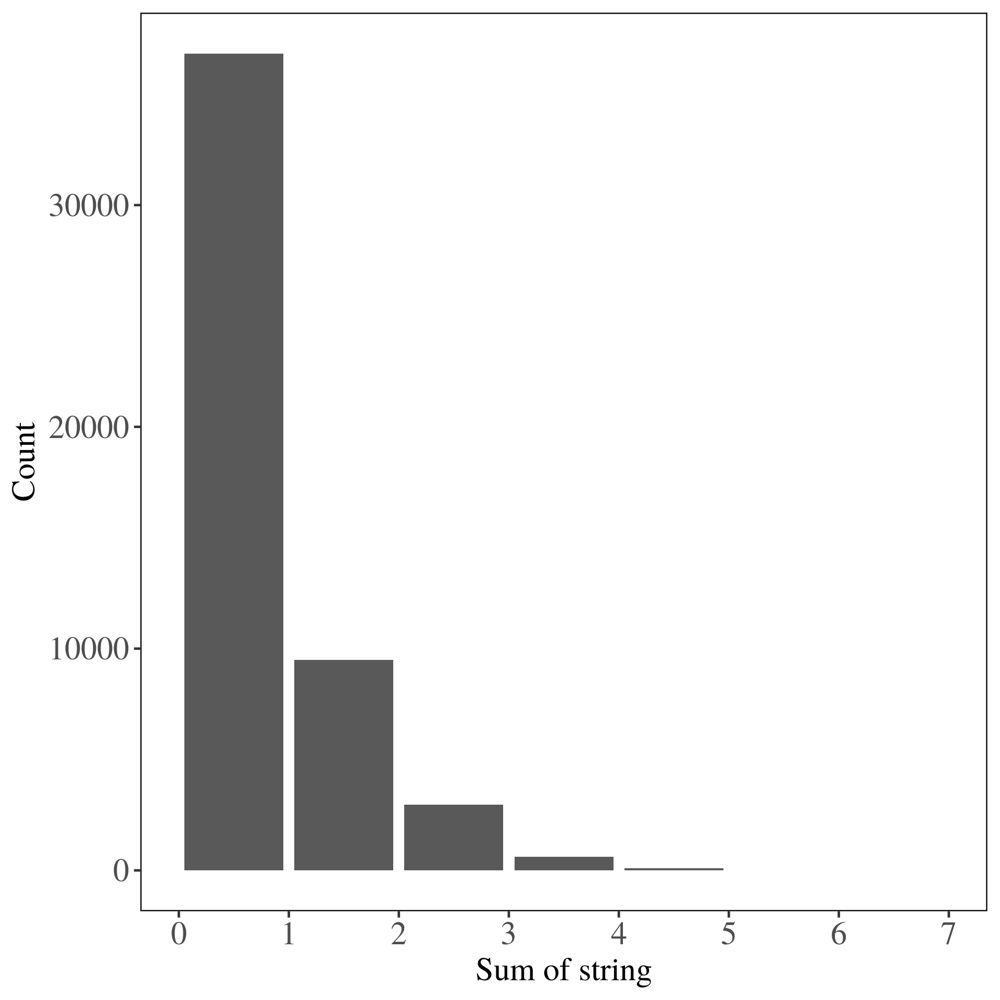

# Inngangur
```{r message=FALSE, warning=FALSE, include=FALSE}
source('scripts/settings.R')
```

Stutt sýnidæmi um hvernig skal skrifa skýrslu í RMarkdown með version-control.

## Uppsetning
Fyrst skal:

  1. Búa til nýtt repo á github (helst með README).
  
  2. Í RStudio:
  
      * File -> New Project -> Version Control
    
      * Copy/Paste slóðina á repo (í mínu tilfelli (https://github.com/thorj/verkferli))
      
Þá ætti repo-ið að birtast á tölvunni ykkar. Það inniheldur bara README skrá en við bætum í það.

  3. Stofna viðeigandi möppur (t.d. \texttt{scripts}, \texttt{data}, \texttt{img}, etc).
  
  4. Prufa að commit og push á git í gegnum RStudio (líka hægt í terminal en þetta er "noob-vænna")
  
Getið notað ssh eða venjulegt log-in. Sjá nánar [hér](https://happygitwithr.com/).
  
# Sýnidæmi
Ef það er verið að vinna með stór gagnasett eða framkvæma dýra útreikngina er tímasóun að vinna allt í einni .Rmd skrá sem þarf að endurkeyra kóðann í hvert skipti sem hún er prjónuð. Betra að búta vinnsluna niður í nokkrar skriptur með vel skilgreind hlutverk. Til dæmis:

  1. \texttt{settings.R}: Hleður inn öllum viðeigandi R pökkum og yfirskrifar default \texttt{ggplot2} stillingar.
  
  2. \texttt{simulate\_binomial.R}: Skripta sem býr til "stórt" gagnasett með óskilvirkum kóða. Ef hann væri í Rmd skránni tæki nokkrar mín að prjóna skjalið í hvert sinn.
  
  3. \texttt{binomial\_wrangl.R}: Eftir að það er búið að búa til gögnin með \texttt{simulate\_binomial.R} þá eru allar myndir og töflur gerðar með þessari skriptu.
  
## Lýsing
```{r message=FALSE, warning=FALSE, include=FALSE}
bi_tab <- read_csv('tables/pop_strings.csv')
```

Til að búa til stutt sýnidæmi voru `r nrow(d)` tvíkosta strengir hermdir og geymdir ásamt summu strengjanna. Algengustu `r nrow(bi_tab)` strengirnir voru fundnir ásamt hlutfalli þeirra af heildarfjölda allra strengja. Strengina ásamt hlutföllum þeirra má sjá í töflu \@ref(tab:strings) og á mynd \ref{fig:stringplt}.

```{r echo=FALSE, message=FALSE, warning=FALSE}
bi_tab %>%
    kable(booktabs = T, 'latex',
        align = c('r', rep('c', 2)),
        col.names = c('Strengur', 'Hlutfall'),
        caption = '(\\#tab:strings) Hér má sjá 10 algengustu strengina ásamt hlutfalli þeirra.',
        linesep = '',
        escape = F) %>%
  kable_styling(full_width = F, latex_options = 'hold_position') %>%
  row_spec(0, bold = T)
```

```{r stringplt, echo=FALSE, fig.align='center', fig.cap="Tíu algengustu strengirnir ásamt hlutfalli þeirra. Hér sést greinilega að 0-strengurinn er algengastur sem er afleiðing að því að strengirnir voru hermdir með litlu $p$.", fig.pos='H', out.width='100%'}

```

Það var líka áhugi fyrir því að teikna stöplarit (súlurit?) af summu strengjanna. Hana má sjá á mynd \ref{fig:sumplt}.

```{r sumplt, echo=FALSE, fig.align='center', fig.cap="Mjög áhugaverð mynd.", fig.pos='H', out.width='100%'}

```

## Umræða
Tekur enga stund að keyra þessa skrá. Ef það þarf að breyta myndum eða töflum er það gert í \texttt{binomial\_wrangl.R} og svo endurprjóna \texttt{index.Rmd}. Allar tölur eru birtar með vísum í minni svo það þarf ekki að endurskrifa neinar tölur. Hef notað þessa uppsetningu til að skila heimadæmum og skýrslum í áföngum eins og Hagnýt Bayesísk tölfræði og Stærðfræðigreining IV þar sem það þurfti að blanda saman kóða, töflum, myndum og stærðfræði. Dæmi um stærðfræði:

$$
\mbox{Ei}(x) = -\int _{-x} ^{\infty} \frac{e^{-t}}{t} dt.
$$

\newpage

# Kóði

## Stillingarskrá: settings.R
```{r, eval = F, code = readLines("scripts/settings.R"), warning=F, message=F}
````

## Hermunarskrá: simulate\_binomial.R
```{r, eval = F, code = readLines("scripts/simulate_binomial.R"), warning=F, message=F}
````

## Gagnavinnsluskrá: binomial\_wrangl.R
```{r, eval = F, code = readLines("scripts/binomial_wrangl.R"), warning=F, message=F}
````
